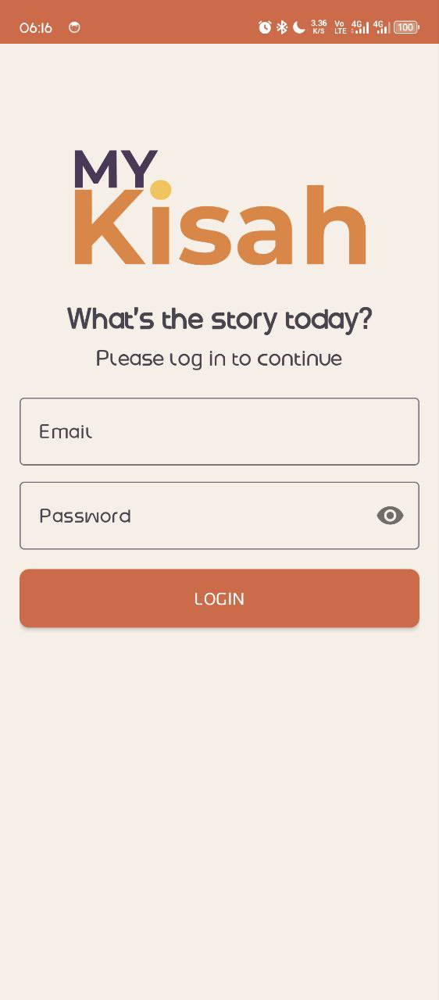
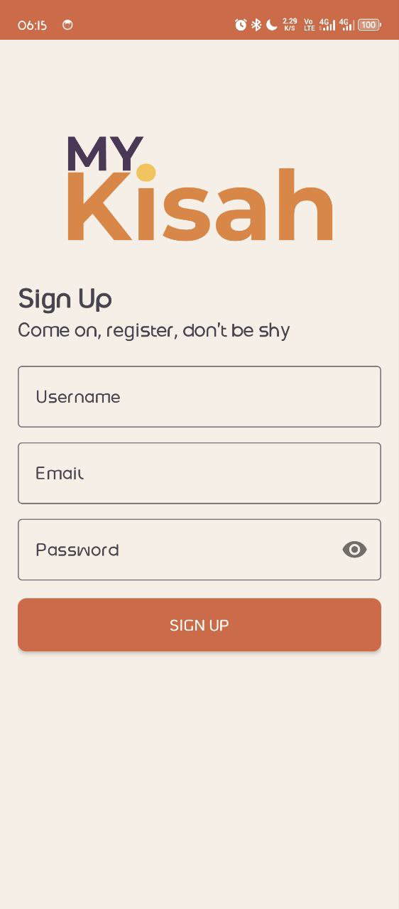
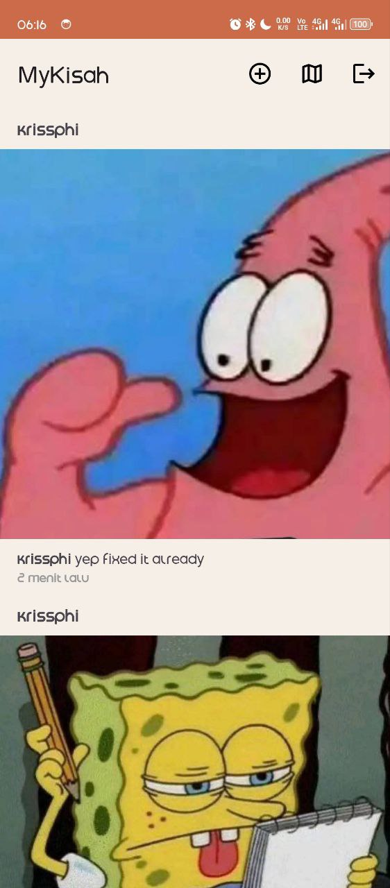

# MyKisah aka Dicoding Story App 

Android application for sharing stories (special for the Dicoding ecosystem) with authentication, list & detail story, add story (gallery/camera + compression), map integration, and Paging.

---

## Screenshot

  
  
  

---

## Features

* **Auth & Session**: Register/Login, store session with DataStore, proper **Logout** handling.
* **List & Detail Story**: RecyclerView + **Paging 3**, item click → detail screen.
* **Add Story**: Select photo from **Gallery** (Camera optional), compress < 1MB, upload; new item appears at the **top**.
* **Maps**: Dedicated map screen displaying markers for stories with location (+ fit bounds).
* **UX**: Loading/Error/Empty states, simple animations (Property/Shared Element), **localization** (id/en) & **accessibility** support.
* **Testing**: Unit tests for ViewModel Paging flow (success & empty scenarios).

---

## Tech Stack

* **Kotlin**, **Coroutines/Flow**
* **MVVM + Repository**
* **Retrofit** + OkHttp (Logging, Auth Interceptor)
* **DataStore Preferences** (session)
* **Paging 3** (+ LoadState UI)
* **Glide/Coil** (images)
* **Google Maps SDK** (map & markers)
* **JUnit**, **Mockito/MockK**, **Coroutines Test** (unit testing)

---

## Closing Note

This project was created as part of the **Dicoding Android Intermediate submission**. The app follows clean structure, best practices, and demonstrates integration with real API, Paging, and Maps. It also emphasizes maintainability, readability, and user experience.

> Built with care by **Krisna Hadi Prasetya (krissphi)** for learning and growth.
